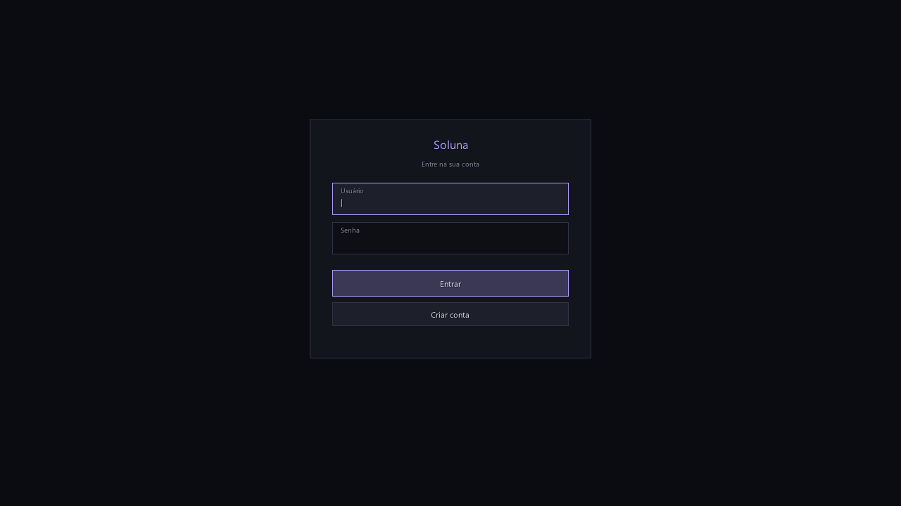
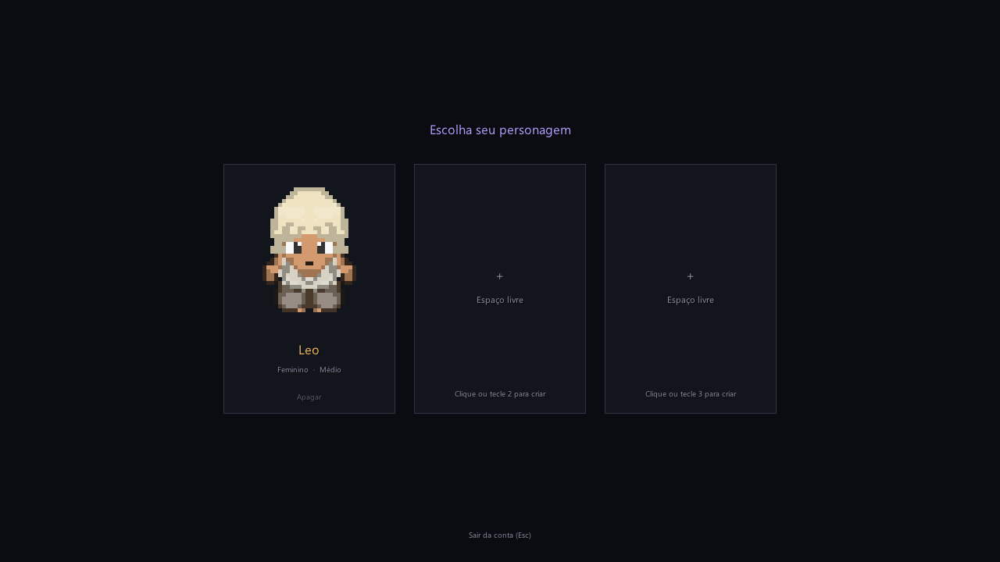
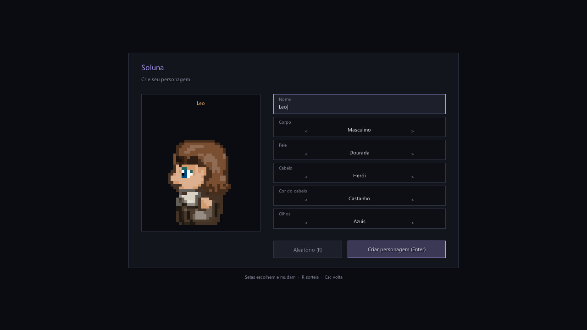
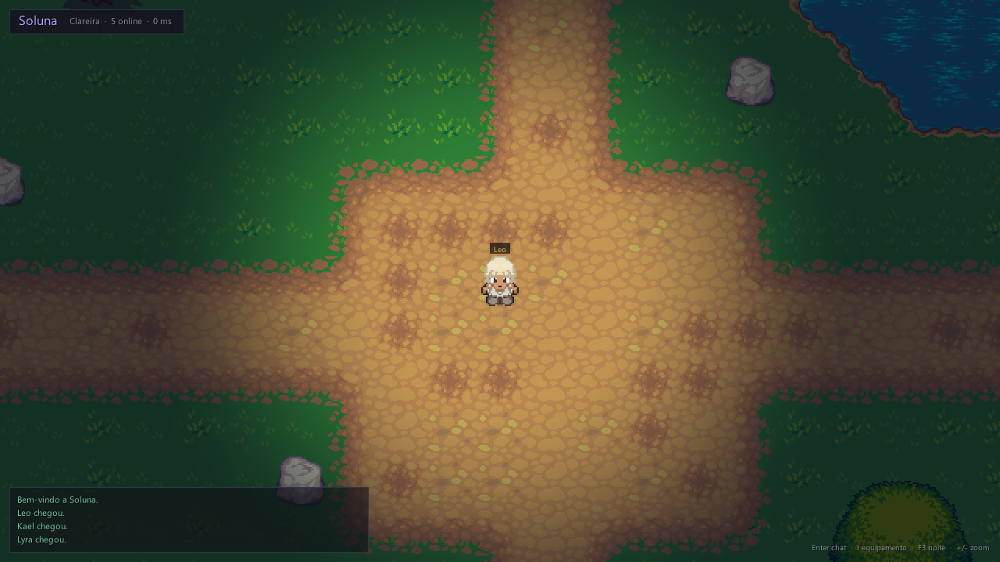
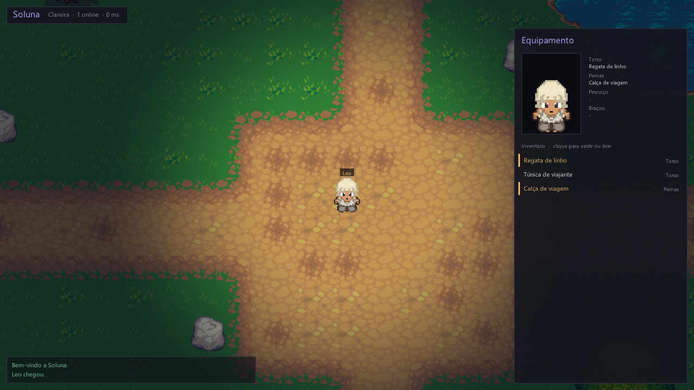
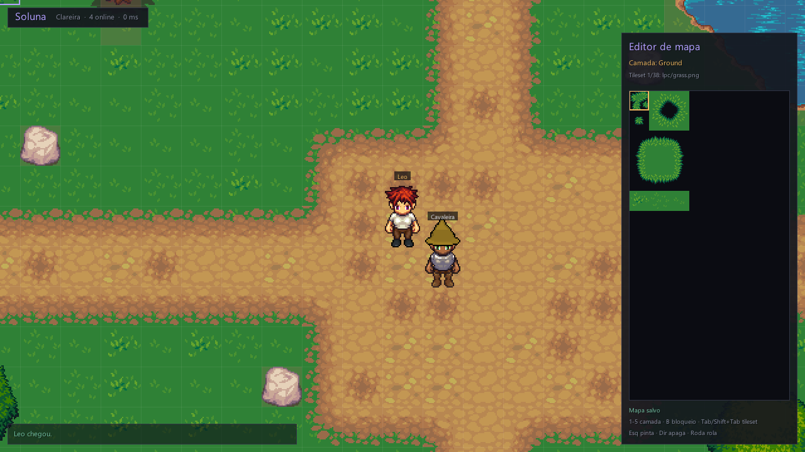

# Soluna

A 2D top-down MMORPG engine in C#. Client, server, accounts with saved characters, paper-doll equipment and an in-game map editor, dark UI.

Soluna follows the shape of [Crystalshire](https://github.com/RobinPerris/Crystalshire), Robin Perris's VB6 engine from the Eclipse ORPG family: a 32x32 tile grid, five map layers, tile-by-tile movement and editors that live inside the game. It is a rewrite, not a port, and none of the VB6 code is carried over.













## What works today

- Authoritative UDP server (LiteNetLib). Clients move straight away for responsiveness; the server checks each step against the map and a movement budget, and snaps a client back when it disagrees
- MonoGame client: layered tile renderer, characters sorted by depth, smooth tile-to-tile walking, camera that follows and clamps to the map, zoom
- Accounts: register and log in, passwords stored only as salted PBKDF2-SHA256 hashes, one session per account
- Up to three characters per account, Crystalshire style, on a select screen; create, play or delete
- Characters are saved on logout and every minute: position, look, equipment and inventory survive a server restart
- Character creation: name, body, skin tone, hair style, hair colour and eyes, with a live walking preview
- Chibi paper-doll characters in RPG Maker style (32x32, 3 frames x 4 directions): body, eyes, hair and every equipped item are separate layers, painted in their colour and stacked at runtime, so changing equipment changes how the character looks to everyone on the map
- Equipment panel (I): click an item to wear it or take it off. Items are plain JSON in `data/items.json`, sent by the server at login; new characters get the ones marked `starter`
- Access levels: the first account created on a server is admin and can edit maps (F1) and use `/item <id>`; everyone has `/online` and `/itens`
- LPC tiles with autotiling for terrain edges and corners; the starter map is a glade with paths, a pond and a pine forest
- Night mode on by default: the world sits under a dark tint with a soft light around your character (F3 toggles it)
- Chat, join and leave messages, player names over heads
- In-game map editor (F1): tile palette, five layers, blocked tiles, Ctrl+S saves to the server and every other player on the map receives the change
- Falls back to placeholder art painted in code if the asset folders are missing

## Run it

Needs the .NET 10 SDK.

```bash
dotnet run --project src/Soluna.Server
```

```bash
dotnet run --project src/Soluna.Client -- --name Leo
```

Create an account on the login screen; the first one on a fresh server becomes admin. Open a second client to see two players.

Client options: `--host`, `--port`, `--user` and `--password` (log in on start), `--play` (also enter with the first character, creating the account and a random character if needed). For testing: `--walk --name X` (a local test account that wanders on its own), `--editor` and `--inventory` (open those panels on entry) and `--screenshot file.png` (save a frame after a few seconds, then quit).

## Controls

| Key | Action |
| --- | --- |
| Arrows / WASD | Walk |
| Enter | Chat |
| I | Equipment |
| F1 | Map editor |
| F3 | Night on or off |
| + / - or mouse wheel | Zoom |

At character creation: up and down pick a row, left and right change it, R randomises, Enter goes in.

In the editor: 1 to 5 picks the layer (Ground, Mask, Mask2 under characters; Fringe, Fringe2 over them), B switches to painting blocked tiles, Tab and Shift+Tab cycle tilesets, left click paints, right click erases, Ctrl+S saves.

## Art

Characters are the layers of IndigoFenix's BoundWorlds Character Maker (CC-BY 4.0), extracted by `tools/extract_chibi.py`. Tiles are the LPC base tiles (CC-BY-SA 3.0 / GPL 3.0), fetched by `tools/fetch_assets.py`. Both ship in `assets/` with their credits. See [assets/README.md](assets/README.md) for how the paper doll works and how to add art, including packs that cannot be redistributed. RPG Maker's RTP and DLC art is licensed for RPG Maker games only, so it is not used.

## Layout

```
src/Soluna.Shared   protocol, map format, constants
src/Soluna.Server   console server, accounts (data/accounts, not committed), maps (data/maps)
src/Soluna.Client   MonoGame client, renderer, UI, editor
data/maps           maps, edited in game
data/items.json     items and the layers they wear
assets              character layers, tiles and credits
tools               asset download script
```

## Next

Encryption for the login (LiteNetLib sends it in the clear, fine on a LAN, not on the internet), items that drop and trade, an autotile brush in the editor, map warps and several maps, chibi-style tiles to match the characters, NPCs and combat, then the card duel system that the VB6 version started.

## Credits

Architecture inspired by Crystalshire by Robin Perris (MIT). Characters by IndigoFenix, tiles by the LPC contributors, credited in `assets/`. Built with [MonoGame](https://monogame.net), [LiteNetLib](https://github.com/RevenantX/LiteNetLib) and [FontStashSharp](https://github.com/FontStashSharp/FontStashSharp).

## License

Code: MIT, see [LICENSE](LICENSE). Art in `assets/`: the licences listed with it.
